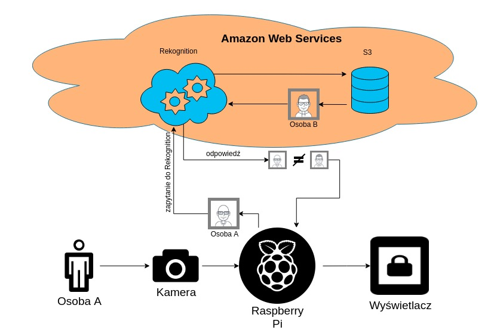
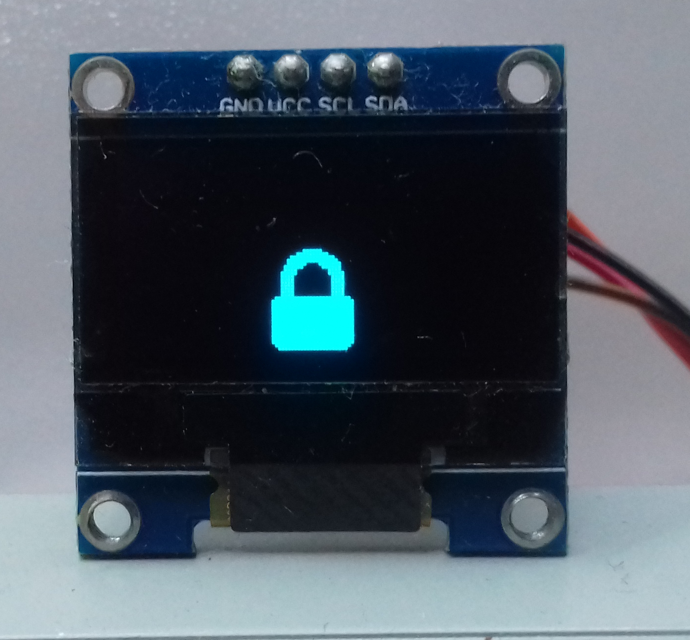
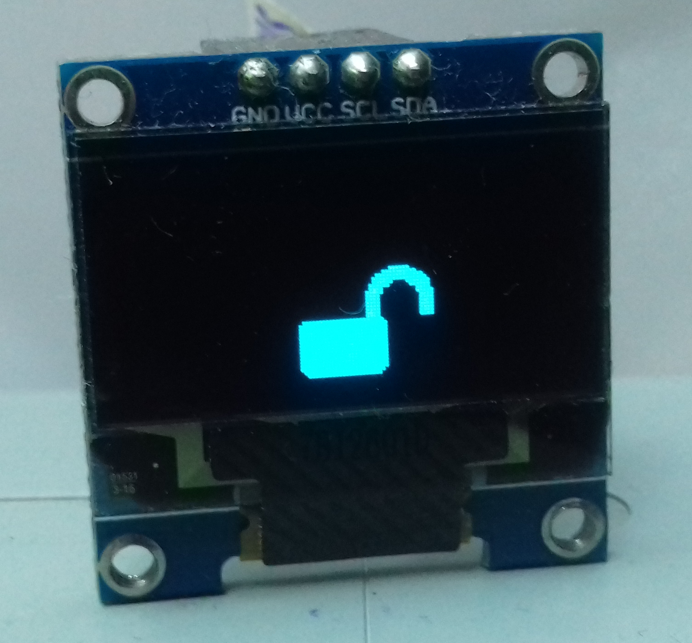

Rozpoznawanie twarzy
===
### Spis treści
1. [Wprowadzenie](#wprowadzenie)
2. [Niezbędne pliki](#pliki)
3. [Kolejność i schemat działania](#schemat)
4. [S3](#s3)
5. [Biblioteki](#biblioteki)
6. [Źródła](#zrodla)
---

### Wprowadzenie:

[Face comparison](https://aws.amazon.com/rekognition/) wykonuje porównywanie twarzy "źródłowej" z każdą twarzą docelową. 
Wszystkie obliczenia są przeprowadzone na serwerach AWS, więc od klienta wymaga się jedynie wysłanie wiadomości z obrazkami.
W moim projekcie będą wykorzystywane 3 zdjęcia docelowe i 1 zdjęcie źródłowe. Zdjęcie źródłowe będzie zrobione kamerką Raspberry Pi. Wynik będzie w postaci wyświetlanej kłódki na małym wyświetlaczu.

### Niezbędne pliki

Nazwa pliku              | Opis
-------------------------|----------------------
fases_comparing_x.x.py   | Główny skrypt projektu
fases_comparing_sample.py| Uproszczony podstawowy skrypt do prezentacji działania 
data.txt                 | Zawiera ścieżki do zasobów S3
closed.png               | Obraz zamkniętej kłódki
open.png                 | Obraz otwartej kłódki

### Kolejność i schemat działania:

Ten schemat pokazuje jak się odbywa porównanie twarzy:

Przede wszystkim jest uruchomiany skrypt Python-a:

    python3 fases_comparing_x.x.py
Od razu zaświeca się wyświetlacz z zamkniętą kłódką:

Dalej po 3 sekundach kamera zapisuje zrobiony obrazek "camera.jpg" w folder gdzie został umieszczony skrypt  *fases_comparing_x.x.py*.
Uruchamia się rozpoznawanie pierwszej osoby:

    if response_person_1()== True:

Tutaj skrypt generuje żądanie w postacie JSON, gdzie umieszcza obrazek *camera.jpg* i ścieżkę do obrazka docelowego w serwisie S3, a następnie wysyła do serwera AWS. Serwer po krótkim czasie dostarcza odpowiedź.
Parametr *"confidence"* jest ustalony na 80% sukcesu rozpoznawania. Mianowicie, jeśli rozpoznawanie jest powyżej 80%, metoda  *response_person* zwróci *True* i zaobserwujemy otwartą kłódkę na wyświetlaczu:

W przypadku nie rozpoznawanie 1 osoby, następuje próba rozpoznawanie drugiej, a następnie trzeciej.

By dostosować ten projekt do swoich potrzeb/rozwiązań, należy w konkretnym miejscu w skrypcie umieścić swój kawałek kodu: 

        if response_person_1()== True:
            print("Hello Person_1!")
            oled("Person1")
            ~ twoj kod ~

        elif response_person_2()== True:
            print("Hello Person_2!")
            oled("Person2")
            ~ twoj kod ~
        elif response_person_3()== True:
            print("Hello Person_3!")
            oled("Person3")
            ~ twoj kod ~
        else:
            print("Photo is not recognise.")
           
           
# Amazon simple storage service(S3)
Jest to "magazyn obiektów" który pozwala na chronienie danych w serwisie chmurowym. W tym projekcie S3 służy do chronienia w nim zdjęć docelowych. By to działało, trzeba umieścic 3 zdjęcia w Bucket S3 i w pliku ***files/data.txt*** wpisać ścieżki do nich:

    "bucket"="my_bucketrpi"            #Nazwa bucket w Amazon S3
    "sourceFile_1"="my_person_1.jpg"   #Zdjęcie 1
    "sourceFile_2"="my_person_2.jpg"   #Zdjęcie 2
    "sourceFile_3"="my_person_3.jpg"   #Zdjęcie 3
Te ścieżki można podać bezpośrednio w sktypcie nie używając dodatkowego pliku ***data.txt***. Należy rozkomentować kolejne pozycje:

    bucket =''
    sourceFile_1 =''
    sourceFile_2 =''
    sourceFile_3 =''

i zakomentować całą pętle for:

    '''
    for line in file_data:
        a = line.split('\"')
        if a[1]=="bucket":
            bucket = a[3]
        elif a[1]=="sourceFile_1":
            sourceFile_1 = a[3]
        elif a[1]=="sourceFile_2":
            sourceFile_2 = a[3]
        elif a[1]=="sourceFile_3":
            sourceFile_3 = a[3]
    '''  
    

### Biblioteki

Nazwa biblioteki         | Opis
-------------------------|---------------------------------------------------------------------
boto3                    | Pakiet programistyczny do wykorzystania Python w Amazon Web Services
picamera                 | Biblioteka do wykorzystania zasobów kamery Raspberry PI
time                     | Biblioteka do wyliczania czasu pracy skryptu
i2c                      | Biblioteka do realizacji komunikacji poprzez interfejs I2C
canvas                   | Służy do renderingu obrazu na wyświetlaczu
ssd1306                  | Biblioteka sterownika Wyświetlacza
 ImageFont, ImageDraw, Image | Dodatkowe biblioteki dla przekształcania obrazu na wyświetlaczu
 
 ---

### Źródła

* [Opis bibliotek OLED](https://ssd1306.readthedocs.io/en/latest/python-usage.html)
* [Comparing Faces in Images AWS](https://docs.aws.amazon.com/rekognition/latest/dg/faces-comparefaces.html)
* [Analyzing Images Stored in an Amazon S3 Bucket](https://docs.aws.amazon.com/rekognition/latest/dg/images-s3.html)
* [Using Boto 3](https://boto3.amazonaws.com/v1/documentation/api/latest/guide/quickstart.html#installation)

