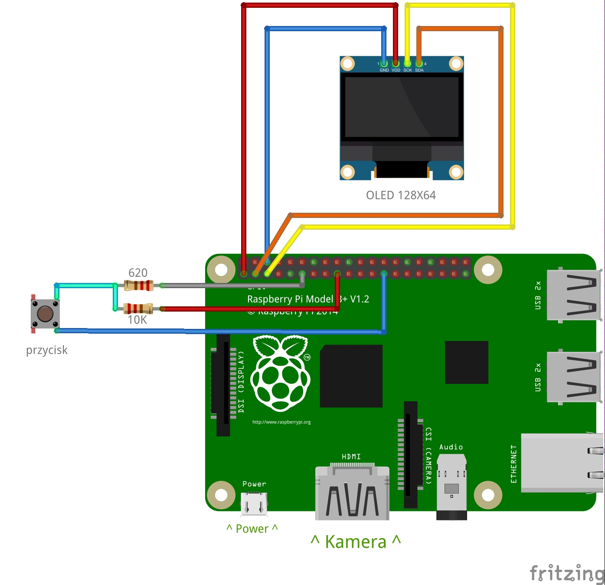

Jak zacząć...
===
### Podstawą tego projektu są:
1. [Instalacja systemu](#instrukcja)
    1. [Pobieranie](#pobieranie)
    2. [Odpakowywanie oraz zapisywanie obrazu](#unzip)
2. [Komponenty i połączenie](#komp)
3. [AWS Command Line Interface](#cli)
4. [Python3](#pliki)
5. [Sterowniki kamery Raspberry Pi dla Python](#camera)
6. [Sterowniki wyświetlacza](#SSD1306)
7. [Źródła](#zrodla)
---

### Instrukcja instalacji systemu operacyjnego Raspberry Pi

#### Pobieranie

*Pobieranie oraz instalacja obrazu odbywa się na systemie UBUNTU*

System można pobrać z oficjalnej strony [www.raspberrypi.org](https://www.raspberrypi.org/downloads/)
Są dwie metody instalacji systemu. Za pomącą instalatora **NOOBS** i gotowego obrazu systemu **Raspbian**.
Z kolei Raspbian ma kilka wersji obrazu:
* RASPBIAN STRETCH WITH DESKTOP AND RECOMMENDED SOFTWARE - obraz zawierający podstawowe pakiety oraz pulpit
* RASPBIAN STRETCH WITH DESKTOP - obraz z pulpitem, ale bez podstawowych pakietów
* RASPBIAN STRETCH LITE - podstawowy obraz bez pulpitu i dodatków

Pobieramy system **"RASPBIAN STRETCH WITH DESKTOP AND RECOMMENDED SOFTWARE"**, by mięć od razu wszystkie narzędzia.
Po pobraniu zaobserwujemy plik *20XX-XX-XX-raspbian-stretch-full.zip*

#### Odpakowywanie oraz zapisywanie obrazu
By odpakować pobrany obraz Raspbian użyjemy polecenie:
  
    unzip 20XX-XX-XX-raspbian-stretch-full.zip
  
Na jakiś czas Terminal może się zawiesić. Dalej wkładamy kartę microSD do czytnika, w moim przypadku jest to przejściówka SD-microSD.
Wykrywamy w systemie naszą kartę poleceniem:
    
    lsblk
    
Wyświetla się coś takiego:

    NAME   MAJ:MIN RM   SIZE RO TYPE MOUNTPOINT
    sda      8:0    0 465,8G  0 disk
    ├─sda1   8:1    0   100M  0 part
    ├─sda2   8:2    0   178G  0 part
    ├─sda3   8:3    0     1K  0 part
    ├─sda4   8:4    0  21,9G  0 part
    ├─sda5   8:5    0 128,8G  0 part /media/user/E2D6493ED64913E7
    ├─sda6   8:6    0  28,2G  0 part /
    ├─sda7   8:7    0   2,5G  0 part [SWAP]
    └─sda8   8:8    0 106,2G  0 part /home
    sdb      8:16   1  14,9G  0 disk
    └─sdb1   8:17   1  14,9G  0 part
    sr0     11:0    1  1024M  0 rom
    loop0    7:0    0   3,8M  1 loop /snap/notepad-plus-plus/167
    loop1    7:1    0 825,3M  1 loop /snap/play0ad/53
    loop2    7:2    0   3,8M  1 loop /snap/notepad-plus-plus/156
    loop3    7:3    0  88,2M  1 loop /snap/core/5897
    loop4    7:4    0     4M  1 loop /snap/notepad-plus-plus/140
    loop5    7:5    0 237,9M  1 loop /snap/wine-platform-i386/25
    loop6    7:6    0  87,9M  1 loop /snap/core/5742
    loop7    7:7    0  87,9M  1 loop /snap/core/5662
    loop8    7:8    0 227,3M  1 loop /snap/wine-platform-i386/23
    loop9    7:9    0  75,3M  1 loop /snap/play0ad/83

Znając pojemność naszej karty, możemy ją znaleść.
W moim przypadku jest to sdb1, która ma pojemność ok 16GB. Przed formatowaniem należy od montować kartę poleceniem:

    sudo umount /dev/sdb1
    
Następnie kasujemy wszystkie pliki:

    sudo dd if=/dev/zero of=/dev/sdb bs=4K && sync

To może trochę potrwać. Po tym tworzymy tabele rozdziałów:

    sudo fdisk /dev/sdb
    
Przywita nas aplikacja fdisk. Po uruchomieniu, należy podać kilka komend używając same litery. By wywołać pomoc, wpisz  ***'m'***.
Niżej jest pokazany przebieg poleceń:

    o - utworzenie nowej, pustej DOS-owej tablicy partycji
    n - dodanie nowej partycji
    p - tworzenie głównej partycji
    1 - numer partycji (1-4, default 1)
    Enter - określamy pierwszy sektor (2048-31116287, default 2048):
    Enter - określamy ostatni sektor, +sektorów lub +rozmiar{K,M,G,T,P} (2048-31116287, default 31116287):
    w - zapis tablicy partycji na dysk i zakończenie

Formatujemy kartę w formacie **vfat** poleceniem:

     sudo mkfs.vfat /dev/sdb1

Zapisujemy odraz Raspbian na kartę:

    sudo dd bs=4M if=20XX-XX-XX-raspbian-stretch-full.zip of=/dev/sdb0 conv=fsync
Bezpiecznie usuwamy kartę:

    sudo eject /dev/sdb
Wkładamy zapisaną kartę do Raspberry PI

# Komponenty i połączenie

# AWS Command Line Interface
Jest to ujednolicone narzędzie do zarządzania usługami AWS. Za pomocą tego można kontrolować wiele usług AWS z poziomu wiersza poleceń i zautomatyzować je za pomocą skryptów.
By kożystać z serwisów Amazon przedewszystkim musimy dokonać [rejestrację.](https://portal.aws.amazon.com/billing/signup#/start) 

Po rejestracji można pobrać **awscli**:

    instalacja pip awscli
  

# Sterowniki kamery Raspberry Pi

By używać kamerę Raspberry Pi trzeba ją po pierwsze podłączyć do samego urządzenia po przez interfejs CSI, a następnie w 
menu konfiguracji *raspi-config* właczyć camerę:

    sudo raspi-config    
    
Po włączeniu należy zresetować urządzenie. Po tym można sprawdzić łącznąść z kamerą poleceniem:

    vcgencmd get_camera
    
Wynik ma być taki:

    supported=1 detected=1
    
Teraz możemy zrobić pierwsze zdjęcie poleceniem:

    raspistill -o myphoto.jpg -t 2000
Zdjęcie domyślnie się zapisuje w katalogu domowym użytkownika.
By Python mógł używać zasoby kamery, należy zainstalować pakiet *picamera* poleceniem niżej:

    sudo apt-get install python-picamera python3-picamera
    
lub możemy dokonać pobranie za pomocą Python’s pip tool:

    sudo pip install picamera
    
Po installacji sprawdzimy działanie Python'a z kamerą. Twożymy plik z rozszerzeniem .py (Umaga! Nie tworzymy plików o nazwie **picamera.py**, ta nazwa jest zarezerwowana), i kopiujemy skrypt:

    from time import sleep
    from picamera import PiCamera

    camera = PiCamera()
    camera.resolution = (1024, 768)
    camera.start_preview()
    sleep(5)
    camera.capture('photo.jpg')
    
Ten skrypt wyświetla okienko *"Preview"* które przedstawia nagrywanie kamery w czasie rzeczywistym i na końcu robi zdjęcie o nazwie "photo.jpg". Okienko "Preview"* będzie widoczne tylko i wyłącznie na wideo wyjściu urządzenia. Z poziomu aplikacja **PuTTy** nic nie zaobserwujemy.
Uruchomiamy poleceniem:

    python3 plik.py
    
    
# Sterowniki wyświetlacza
W tym projekcie jaki dodatkową opcją wyprowadzenia informacji jest wyświetlacz na kontrolerze **ssd1306** z rozdzielcząścią **128X64**. Komynikacja pomiędzy Raspberry Pi i wyświetlaczem odbywa się po przez interfejs I2C.
Kontroler **ssd1306** obsługuje biblioteka [**Luma**](https://luma-oled.readthedocs.io/en/latest/intro.html).
Poniżej znajduje się instrukcja instalacji bibliotek Luma:

    sudo apt-get install python-dev python-pip libfreetype6-dev libjpeg-dev build-essential
    sudo -H pip install --upgrade luma.oled
    
Po instalacji w katalogu domowym pojawi się folder *codelectron_projects/Rpi/OLED* w którym znajdziemy napisane skrypty z przykładami uzycia tego wyświetlacza.

 ---

### Źródła

* [AWS Command Line Interface Getting Started](https://aws.amazon.com/cli/)
* [Getting started with picamera](https://projects.raspberrypi.org/en/projects/getting-started-with-picamera)
* [Installation picamera](https://picamera.readthedocs.io/en/release-1.13/install.html#raspbian-installation)
* [Luma.OLED Drivers](https://luma-oled.readthedocs.io/en/latest/index.html)

